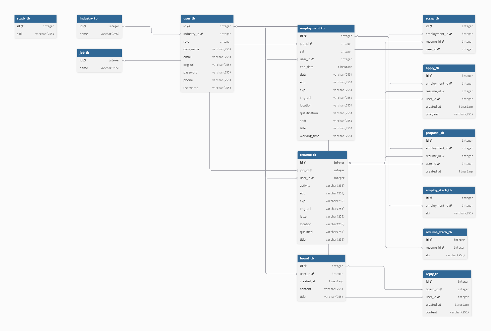

# 시연 영상

# 목차
1. [💡 프로젝트 소개](#프로젝트-소개)
2. [📝 프로젝트 후기](#프로젝트-후기)
3. [🗂️ ERD](#erd)
4. [👥 팀원](#팀원)
5. [🧠 핵심 기능](#핵심-기능)
6. [🔧 보완할 점](#보완할-점)
7. [📏 코드 컨벤션](#코드-컨벤션)

# 프로젝트 소개
- 1차 프로젝트를 JSON을 활용해서 데이터만 전송하는 REST API 기반 자원 서버로 전환 프로젝트입니다.

### 변경점
**API 응답 구조 개선**
- 모든 응답을 ResponseEntity로 일관되게 반환
- 모든 데이터 전달을 DTO 기반으로 통일하여 구조 개선
- 예외 발생 시 공통 에러 응답 형식을 적용하여 일관성 유지

**안정성과 테스트**
- 유효성 검사 로직 강화 (@Valid, @NotNull, @Email 등 적극 활용)
- 단위 테스트(Unit Test)를 도입하여 기능의 신뢰성과 안정성 확보
- 인터셉터 개선을 통해 인증 흐름 정리 및 예외 대응 보완

**보안 강화**
- JWT 기반 인증 적용 (Access Token만 사용)
- 비밀번호 암호화에 BCrypt 알고리즘 적용
- 필터 설정 및 입력값 검증 강화로 보안성 향상

**데이터 처리 및 정합성**
- 더미 데이터 정제 및 일치화
- Enum을 활용해 고정값 처리 및 코드 가독성 개선
- 주소 구조를 재설계하여 데이터 정합성 강화

**그 외 개선 사항**
- 화면 삭제 및 완전한 REST API 구조로 전환
- 이미지 전송 방식을 JSON(Base64) 형태로 변경 (파일 직접 저장 방식 제거)
- HTTP 메서드 (GET, POST, PUT, DELETE) 사용 기준을 명확히 분리하여 설계

### 프로젝트 기간
    2025.05.12 ~ 2025.05.22

# 프로젝트 후기
- 이번 프로젝트는 화면 없이 데이터를 반환하는 REST API 서버였기 때문에, 프론트엔드 개발자가 원하는 데이터를 정확하게 이해하고 전달하는 것이 중요했습니다. 이를 위해 어떤 형태로 데이터를 주고받을지 깊이 고민하며, DTO를 어떻게 설계할지에 대해 많은 학습이 있었습니다.
- 서버가 REST API 형태로 제공되는 만큼, 화면 개발은 프론트엔드에서 담당하게 되는데, 이때 API URL을 어떻게 설계해야 직관적이고 명확할지 고민이 많았습니다. 어떤 단어를 사용하고, 어떤 흐름으로 구성해야 프론트엔드 개발자가 한눈에 이해할 수 있을지 스스로 계속해서 고민하며 API 설계에 대한 감각을 키워갈 수 있었던 경험이었습니다.
- 통합 테스트는 단순히 빠르게 오류를 확인하는 수단을 넘어서, 실제 배포 직전에도 핵심적인 역할을 한다는 것을 깨달았습니다. 특히 API 문서를 만들거나, 프론트와 연동 전 최종 점검을 할 때 매우 유용했습니다. 통합 테스트를 통과하지 못한다는 것은 결국 어딘가에서 로직이나 흐름이 깨졌다는 의미이므로, 안정적인 배포를 위해 반드시 필요한 과정임을 실감했습니다.

  
### Stacks Used

### Cooperated With

 

# ERD

# 팀원

|                                                          문정준                                                           |                                                           편준민                                                            |                                                       서회정                                                        |                                                        손영민                                                        |
|:----------------------------------------------------------------------------------------------------------------------:|:------------------------------------------------------------------------------------------------------------------------:|:----------------------------------------------------------------------------------------------------------------:|:-----------------------------------------------------------------------------------------------------------------:|
|  |   |  |  |
|                                                           팀장                                                           |                                                            팀원                                                            |                                                        팀원                                                        |                                                        팀원                                                         |
|                                           [GitHub](https://github.com/Sxias)                                           |                                           [GitHub](https://github.com/JunMin0529)                                           |                                      [GitHub](https://github.com/clubnerdy)                                      |                                      [GitHub](https://github.com/son7571)                                      |

 
 

# 핵심 기능

## 유저 관련 기능

- 로그인
- 회원가입
- 회원수정

## 채용 관련 기능

### 구직자

- 이력서 관리
- 이력서 지원
- 채용 공고 즐겨찾기
- 채용 공고 추천받기

### 기업

- 채용 공고 관리
- 지원 현황 관리
- 구직자에게 채용 공고 추천하기
- 이력서 즐겨찾기

### 공통

- 이력서 또는 채용 공고 매칭

# 보완할 점
- Enum을 사용하지 못한 점

# 코드 컨벤션
https://getinthere.notion.site/Code-Convention-1d58a08b6c0d805db749d4db6cfc9637?pvs=4
